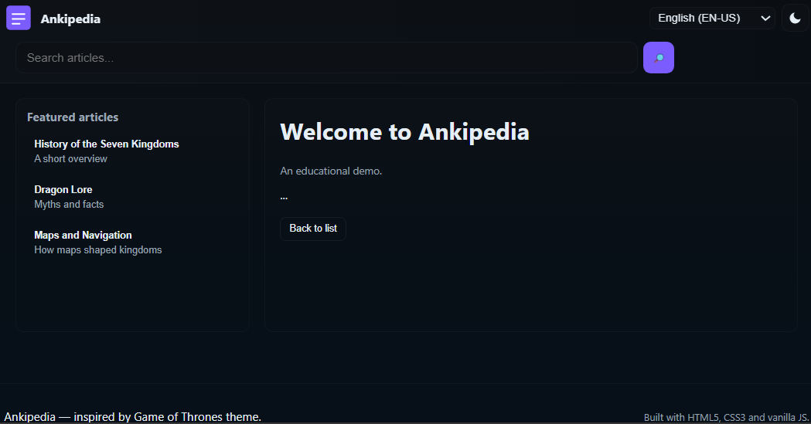

Daily learning

# Recreating Wikipedia with a Modern Layout

Project developed at the Bootcamp HTML Web Developer Training, under the guidance of specialist [Diogo Mainardes](https://github.com/diogomainardes "Diogo Mainardes").

## Module 3 - HTML Track

Title: Recreating Wikipedia with a Better Layout

## Objective

This challenge consists of training you on website structure, and also applying acquired knowledge about semantics, accessibility, and responsiveness.

## Challenge

This repository contains a basic pre-assembled structure of a simple layout with a little CSS applied. Just to make it more presentable.

Feel free to create it however you want, and on whatever topics you want.
The intention here is to have fun, and at the same time learn from the challenge.

Follow the instructions in the video prompt.
I believe it will be easier to understand how to proceed there.

# Technologies used

- HTML5
- CSS3
- Vanilla JS
- AI (Artificial Intelligence)

# Useful Links

[Download NVDA](https://www.nvaccess.org/download/)

[Wikipedia](https://pt.wikipedia.org/)

[LICENSE](/LICENSE)

See [original repository](https://github.com/digitalinnovationone/trilha-html-modulo-3).

